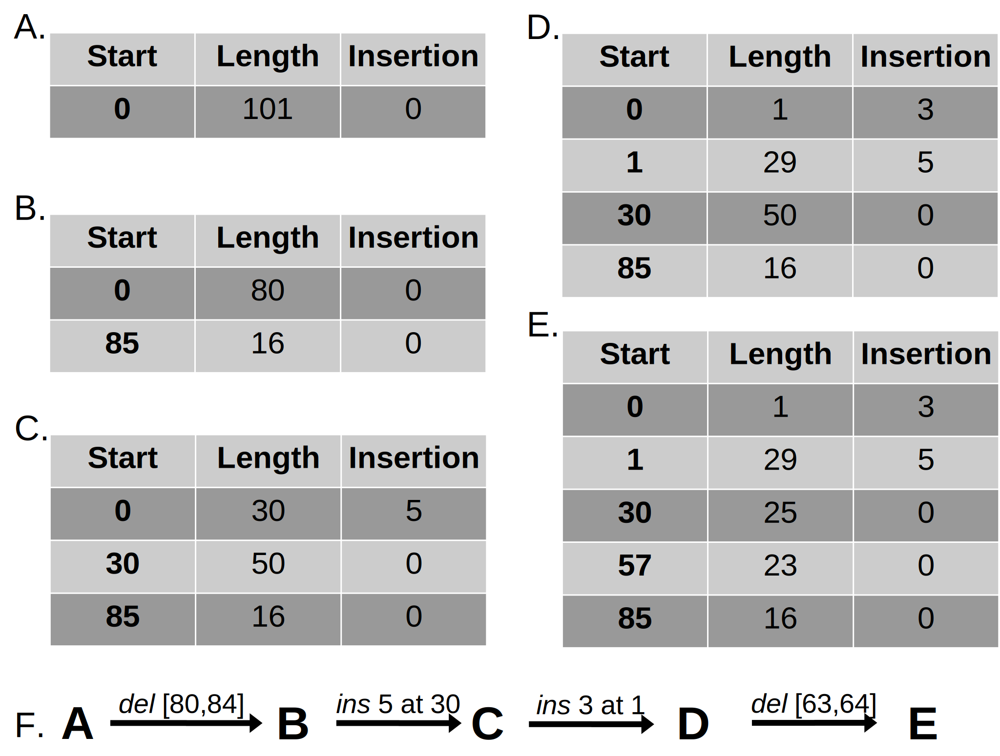

# Evo-Sim: Efficient Sequence Evolution Simulator

A research toolkit for simulating sequence evolution along phylogenetic trees, developed to benchmark efficient algorithms for insertion/deletion (indel) events. This simulator was primarily built for comparing novel bookkeeping methods against naive implementations and real-world simulators like AliSim.

**Research Paper:** *Efficient algorithms for simulating sequences along a phylogenetic tree* by Elya Wygoda, Asher Moshe, Nimrod Serok, Edo Dotan, Noa Ecker, Naiel Jabareen, Omer Israeli, Itsik Pe'er, and Tal Pupko (under review).

## Abstract

**Motivation:** Sequence simulations along phylogenetic trees play an important role in numerous molecular evolution studies such as benchmarking algorithms for ancestral sequence reconstruction, multiple sequence alignment, and phylogeny inference. They are also used in phylogenetic model-selection tasks, including the inference of selective forces. Recently, Approximate Bayesian Computation (ABC)-based approaches have been developed for inferring parameters of complex evolutionary models, which rely on massive generation of simulated data. For all these applications, computationally efficient sequence simulators are essential.

**Results:** We investigate fast algorithms for simulating sequences along a phylogenetic tree, focusing on accelerating the speed-limiting component: handling insertion and deletion (indel) events. We demonstrate that data structures which efficiently store indel events along a tree can substantially accelerate the simulation process compared to a naive approach. To illustrate the utility of this efficient simulator, we integrated it into an ABC-based algorithm for inferring indel model parameters and applied it to study indel dynamics within Chiroptera.

---

## Features

- **Multiple Indel Algorithms**: Compare naive O(k×n), block list O(k×b), and block tree O(k×log(b)) implementations
- **Substitution Simulation**: JTT model implementation using Gillespie algorithm and matrix exponentiation methods  
- **Combined Simulation**: Unified pipeline combining indel and substitution events for benchmarking
- **Command-Line Interface**: Three specialized CLI tools for different simulation types
- **Performance Benchmarking**: Built-in timing and memory usage analysis for algorithm comparison
- **Flexible Parameters**: Customize rates, length distributions, and sequence parameters
- **Reproducible Results**: Seed-based random number generation

**Note:** This simulator was developed primarily for research and benchmarking purposes, comparing the efficiency of novel bookkeeping methods against naive implementations and established simulators like AliSim.

## Installation

### Prerequisites

- Python 3.8 or higher
- pip package manager

### Install from Source

```bash
git clone https://github.com/nimrodSerokTAU/evo-sim.git
cd evo-sim
pip install -r requirements.txt
pip install -e .
```

After installation, three command-line tools will be available:
- `indel-simulator`: Indel-only simulations
- `substitution-simulator`: Substitution-only simulations  
- `msa-simulator`: Combined indel and substitution simulations

## Quick Start

### Combined Simulation

```bash
msa-simulator \
    --type list \
    --insertion_rate 0.01 \
    --deletion_rate 0.01 \
    --substitution_rate 1.0 \
    --tree_file tree.newick \
    --output_directory ./results
```

### Indel-Only Simulation

```bash
indel-simulator \
    --type tree \
    --insertion_rate 0.03 \
    --deletion_rate 0.09 \
    --tree_file tree.newick \
    --output_directory ./results
```

### Substitution-Only Simulation

```bash
substitution-simulator \
    --substitution_rate 2.0 \
    --algorithm matrix \
    --tree_file tree.newick \
    --output_directory ./results
```

## Algorithm Overview

### Novel Bookkeeping Methods

Our approach separates indel and substitution simulations for enhanced efficiency:

<div style="background-color: white; padding: 10px; border-radius: 5px;">


</div>

**Figure 1:** Separation of indel and substitution simulations. (A) Simulation of indel events while disregarding the sequence content, creating a template for the resulting alignment; (B) The resulting alignment size is used to simulate the sequence content and substitution events; (C) The indel template and sequence content are combined for the final alignment.

### Block-Based Data Structure

The core innovation lies in our **block-based bookkeeping method** that efficiently tracks indel events:

<div style="background-color: white; padding: 10px; border-radius: 5px;">



</div>

**Figure 2:** Example of the processing of the data structure used for bookkeeping indel events along a branch of a phylogenetic tree.

### Algorithm Comparison

#### Indel Simulation Algorithms

For a single branch:

| Method | Time Complexity | Description |
|--------|----------------|-------------|
| **Naive** | O(k×n') | Applies each event directly on sequence copy |
| **Block List** | O(k×b + n') | Linear search through block list |
| **Block Tree** | O(k×log(b) + n') | Binary search using AVL tree structure |

Where:
- k = number of indel events
- n' = maximum sequence length during evolution  
- b = number of blocks (≤ min(k,n))

#### Substitution Simulation Algorithms

| Method | Algorithm | Description |
|--------|-----------|-------------|
| **Gillespie** | Event-based CTMC | Simulates individual substitution events with exact timing |
| **Matrix** | Matrix Exponentiation | Computes final sequences using transition probability matrices exp(Qt) |

**Note:** Substitution simulation currently supports only the JTT model and was implemented primarily for demonstration and benchmarking purposes. Both methods are mathematically exact and produce statistically identical results.

## Theoretical Performance Analysis

### Indel Algorithm Complexity
- **Naive method**: O(k×n') - Each indel event requires copying and modifying the entire sequence
- **Block list method**: O(k×b + n') - Linear search through blocks for each event, where b ≤ min(k,n)
- **Block tree method**: O(k×log(b) + n') - Binary search using AVL tree structure provides optimal performance

### Expected Performance Characteristics
- **Small number of events (k << n)**: All methods perform similarly
- **Large number of events (k ≈ n)**: Block tree method shows significant theoretical advantage
- **Dense indel regions**: Block-based methods excel due to efficient bookkeeping

### Substitution Algorithm Complexity
- **Gillespie algorithm**: Complexity increases with expected number of substitutions (branch_length × rate × sequence_length)
- **Matrix exponentiation**: Constant complexity regardless of actual substitution events that occur

**Note:** These theoretical complexities can be empirically validated using the benchmarking features built into each simulator.

## Command-Line Arguments

### Combined Simulator (`msa-simulator`)

#### Required Arguments
- `--type {naive,list,tree}`: Indel simulation algorithm type
- `--insertion_rate FLOAT`: Insertion rate per site per unit time
- `--deletion_rate FLOAT`: Deletion rate per site per unit time  
- `--tree_file PATH`: Path to Newick format phylogenetic tree file

#### Optional Arguments
- `--substitution_rate FLOAT`: Substitution rate per site per unit time (default: 1.0)
- `--algorithm {gillespie,matrix}`: Substitution algorithm (default: matrix)
- `--original_sequence_length INT`: Root sequence length (default: 1000)
- `--number_of_simulations INT`: Number of simulation runs (default: 1)
- `--output_type {drop_output,multiple_files,single_file}`: Output format (default: single_file)
- `--output_directory PATH`: Output directory (default: ./results)
- `--seed INT`: Random seed for reproducibility (default: 42)
- `--benchmark`: Enable performance benchmarking
- `--verbose`: Enable verbose output

#### Length Distribution Parameters
- `--insertion_length_distribution_parameter FLOAT`: Zipf distribution parameter for insertions (default: 2.0)
- `--deletion_length_distribution_parameter FLOAT`: Zipf distribution parameter for deletions (default: 2.0)
- `--insertion_length_truncation INT`: Maximum insertion length (default: 50)
- `--deletion_length_truncation INT`: Maximum deletion length (default: 50)

### Individual Simulators

The `indel-simulator` and `substitution-simulator` tools accept similar arguments for their respective simulation types. Run with `--help` for detailed parameter lists.

## Advanced Usage Examples

### High-Throughput Benchmarking

```bash
msa-simulator \
    --type tree \
    --insertion_rate 0.03 \
    --deletion_rate 0.09 \
    --substitution_rate 2.0 \
    --algorithm matrix \
    --original_sequence_length 500 \
    --number_of_simulations 100 \
    --tree_file tree.newick \
    --output_directory ./benchmark_results \
    --benchmark \
    --verbose
```

### Custom Length Distributions

```bash
indel-simulator \
    --type list \
    --insertion_rate 0.02 \
    --deletion_rate 0.02 \
    --insertion_length_distribution_parameter 1.5 \
    --deletion_length_distribution_parameter 2.5 \
    --insertion_length_truncation 100 \
    --deletion_length_truncation 75 \
    --tree_file tree.newick \
    --output_directory ./custom_results
```

## Benchmark Data

The repository includes comprehensive benchmark data in `benchmark/`:

- **TRUE_TREES/**: Phylogenetic trees from mammalian sequences (OrthoMaM database)
- **assets/data/**: Performance comparison results across different algorithms
- **scripts/**: Benchmarking and comparison utilities
- **notebooks/**: Analysis notebooks for tree statistics and performance evaluation

## Integration with SpartaABC

A similar simulator has been integrated with SpartaABC for Approximate Bayesian Computation-based inference of indel parameters. Visit [https://spartaabc.tau.ac.il/](https://spartaabc.tau.ac.il/) for more information.

## Citation

If you use this tool in your research, please cite:

```
Wygoda, E., Moshe, A., Serok, N., Dotan, E., Ecker, N., Jabareen, N., Israeli, O., Pe'er, I., & Pupko, T. 
Efficient algorithms for simulating sequences along a phylogenetic tree. 
(manuscript under review)
```

## License

This project is licensed under the Academic Free License v. 3.0. See the LICENSE file for details.

## Contact

For questions or support, please contact:
- Elya Wygoda: elyawygoda@mail.tau.ac.il
- Tal Pupko: talp@tauex.tau.ac.il
- GitHub Issues: [https://github.com/nimrodSerokTAU/evo-sim/issues](https://github.com/nimrodSerokTAU/evo-sim/issues)

## Acknowledgments

- The Shmunis School of Biomedicine and Cancer Research, Tel Aviv University
- The Henry and Marilyn Taub Faculty of Computer Science, Technion  
- Department of Computer Science, Columbia University

This research was supported by the Israel Science Foundation (ISF) [2818/21 to T.P.].

E.W., N.S., A.M., and N.E. were supported in part by a fellowship from the Edmond J. Safra Center for Bioinformatics at Tel Aviv University. The list-based, tree-based, and super sequence algorithms were developed by A.M. and are described in his PhD thesis.

The code in this repository was written by Nimrod Serok, Naiel Jabareen, and Elya Wygoda.