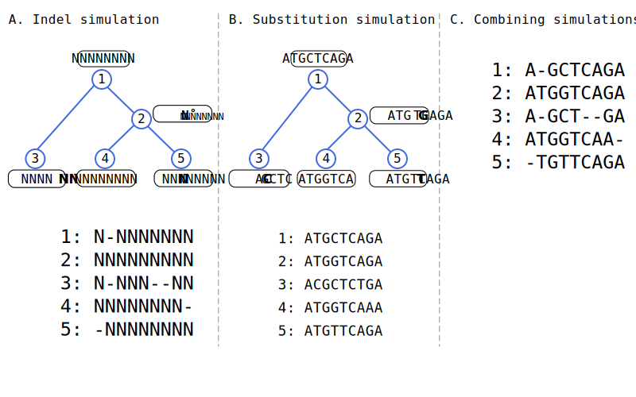

# Indel Simulator CLI Tool

A high-performance command-line tool for simulating insertion and deletion (indel) events along phylogenetic trees. This tool implements three different algorithms with varying computational complexities for handling indel events efficiently.

Based on the research paper: **"Efficient algorithms for simulating sequences along a phylogenetic tree"** by Elya Wygoda, Asher Moshe, Nimrod Serok, Edo Dotan, Noa Ecker, Omer Israeli, Itsik Pe'er, and Tal Pupko.

## Abstract

**Motivation:** Sequence simulations along phylogenetic trees play an important role in numerous molecular evolution studies such as benchmarking algorithms for ancestral sequence reconstruction, multiple sequence alignment, and phylogeny inference. They are also used in phylogenetic model-selection tasks, including the inference of selective forces. Recently, Approximate Bayesian Computation (ABC)-based approaches have been developed for inferring parameters of complex evolutionary models, which rely on massive generation of simulated data. For all these applications, computationally efficient sequence simulators are essential.

**Results:** In this study, we investigate fast algorithms for simulating sequences along a phylogenetic tree, focusing on accelerating the speed-limiting component of the simulation process: handling insertion and deletion (indel) events. We demonstrate that data structures which efficiently store indel events along a tree can substantially accelerate the simulation process compared to a naive approach. To illustrate the utility of this efficient simulator, we integrated it into an ABC-based algorithm for inferring indel model parameters and applied it to study indel dynamics within Chiroptera.

**Availability and Implementation:** The source code for the different simulation algorithms, alongside the data used, is available at: https://github.com/nimrodSerokTAU/evo-sim. The simulator has also been integrated into SpartaABC, a website for the inference of indel parameters, accessible at: https://spartaabc.tau.ac.il/

---

## Novel Bookkeeping Methods

### Simulation Strategy Overview

Our approach separates indel and substitution simulations for enhanced efficiency:

<div style="background-color: white; padding: 10px; border-radius: 5px;">



</div>

**Figure 1:** Separation of indel and substitution simulations and their merger. (A) Simulation of indel events while disregarding the sequence content, creating a template for the resulting alignment; (B) The resulting alignment size is used to simulate the sequence content and substitution events; (C) The indel template and sequence content are combined for the final alignment.

### Novel Bookkeeping Data Structure

The core innovation lies in our **block-based bookkeeping method** that efficiently tracks indel events:

<div style="background-color: white; padding: 10px; border-radius: 5px;">


</div>

**Figure 2:** Example of the processing of the data structure used for bookkeeping indel events along a branch of a phylogenetic tree. Each row corresponds to a block: (A) The initial data structure.


### Super-sequence Generation and MSA Reconstruction

<div style="background-color: white; padding: 10px; border-radius: 5px;">


</div>

**Figure 3:** Evolution of the sequence alignment through indel events. (A) Phylogenetic tree showing three species and five nodes (numbered 1-5) with indel events (represented by stars) along the branches. Each event is labeled with its type, position, and length. (B) The final super-sequence after pre-order tree traversal. (C) Alongside updating the super-sequence, the sequences at each node are updated, accounting for deletions. (D) The final template alignment.
<!-- ## Citation

If you use this tool in your research, please cite:

```
Wygoda, E., Moshe, A., Serok, N., Dotan, E., Ecker, N., Israeli, O., Pe'er, I., & Pupko, T. 
Efficient algorithms for simulating sequences along a phylogenetic tree. 
``` -->

## Features

- **Multiple Algorithms**: Choose from naive O(k×n), block list O(k×b), or block tree O(k×log(b)) implementations
- **Flexible Parameters**: Customize insertion/deletion rates, length distributions, and sequence parameters
- **Performance Benchmarking**: Built-in timing and performance analysis
- **Reproducible Results**: Seed-based random number generation

## Installation

### Prerequisites

- Python 3.8 or higher
- pip package manager

### Install Dependencies

```bash
pip install -r requirements.txt
```

### Install from Source

```bash
git clone https://github.com/nimrodSerokTAU/evo-sim.git
cd evo-sim
pip install -e .
```

## Quick Start

### Basic Usage

```bash
python indel_simulator.py \
    --type list \
    --insertion_rate 0.01 \
    --deletion_rate 0.01 \
    --tree_file tree.newick \
    --output_directory ./results
```

### Advanced Usage

```bash
python indel_simulator.py \
    --type tree \
    --insertion_rate 0.03 \
    --deletion_rate 0.09 \
    --insertion_length_distribution_parameter 2.0 \
    --insertion_length_truncation 50 \
    --deletion_length_distribution_parameter 2.0 \
    --deletion_length_truncation 50 \
    --original_sequence_length 1000 \
    --tree_file tree.newick \
    --number_of_simulations 100 \
    --output_type single_file \
    --output_directory ./results \
    --benchmark \
    --verbose
```

## Command Line Arguments

### Required Arguments

- `--type {naive,list,tree}`: Simulation algorithm type
- `--insertion_rate FLOAT`: Insertion rate per site per unit time
- `--deletion_rate FLOAT`: Deletion rate per site per unit time
- `--tree_file PATH`: Path to Newick format phylogenetic tree file

### Length Distribution Arguments

- `--insertion_length_distribution_parameter FLOAT`: Parameter for Zipf insertion length distribution (default: 2.0)
- `--insertion_length_truncation INT`: Maximum insertion length (default: 50)
- `--deletion_length_distribution_parameter FLOAT`: Parameter for Zipf deletion length distribution (default: 2.0)
- `--deletion_length_truncation INT`: Maximum deletion length (default: 50)

### Simulation Parameters

- `--original_sequence_length INT`: Length of the root sequence (default: 1000)
- `--deletion_extra_edge_length INT`: Extra positions before sequence start for deletion events (default: 49)
- `--number_of_simulations INT`: Number of independent simulation runs (default: 1)
- `--seed INT`: Random seed for reproducibility (default: 42)

### Output Options

- `--output_type {drop_output,multiple_files,single_file}`: Output format (default: single_file)
- `--output_directory PATH`: Directory to save simulation results (default: ./simulation_results)
- `--verbose`: Enable verbose output
- `--benchmark`: Run benchmarking and report performance statistics

## Algorithm Comparison

For a single branch:

| Method | Time Complexity | Description |
|--------|----------------|-------------|
| **Naive** | O(k×n') | Applies each event directly on sequence copy |
| **Block List** | O(k×b + n') | Linear search through block list |
| **Block Tree** | O(k×log(b) + n') | Binary search using AVL tree structure |

Where:
- k = number of indel events
- n' = maximum sequence length during evolution
- b = number of blocks (≤ min(k,n))

## Output Formats

### FASTA Format
```
# Simulation 1
# Runtime: 0.123s
# Simulation type: tree
# Insertion rate: 0.01
# Deletion rate: 0.01
# Seed: 42
>1
ATGCGATCGATCG--ATCGATCG
>2
ATGC--TCGATCGATCGATCG--
```

The simulator outputs multiple sequence alignments in FASTA format with header comments containing simulation metadata.

## Performance Tips

1. **For small tree branches (< 1.0) and insertion rate up to 0.1**: Use `--type list` for good performance
1. **For large tree branches (> 1.0) and insertion rate higher than 0.05**: Use `--type tree` for best performance
1. **For benchmarking**: Use `--benchmark` flag to get detailed timing information
1. **For reproducibility**: Always set `--seed` to a fixed value

## Tree File Format

The tool accepts phylogenetic trees in Newick format:

```
((A:0.1,B:0.1):0.05,(C:0.08,D:0.12):0.05);
```

Branch lengths represent evolutionary time in substitutions per site.

## Integration with SpartaABC

A similar simulator was integrated with SpartaABC for Approximate Bayesian Computation-based inference of indel parameters. Visit [https://spartaabc.tau.ac.il/](https://spartaabc.tau.ac.il/) for more information.


## License

This project is licensed under the Academic Free License v. 3.0. See the LICENSE file for details.

## Contact

For questions or support, please contact:
- Elya Wygoda: elyawygoda@mail.tau.ac.il
- GitHub Issues: [https://github.com/nimrodSerokTAU/evo-sim/issues](https://github.com/nimrodSerokTAU/evo-sim/issues)

## Acknowledgments

- The Shmunis School of Biomedicine and Cancer Research, Tel Aviv University
- The Henry and Marilyn Taub Faculty of Computer Science, Technion
- Department of Computer Science, Columbia University

This research was supported by the Israel Science Foundation (ISF) [2818/21 to T.P.].

E.W., N.S., A.M., and N.E. were supported in part by a fellowship from the Edmond J. Safra
Center for Bioinformatics at Tel Aviv University. The list-based, tree-based, and super
sequence algorithms were developed by A.M. and are described in his PhD thesis.

The code in this repository was mostly written  by Nimrod Serok and Elya Wygoda.